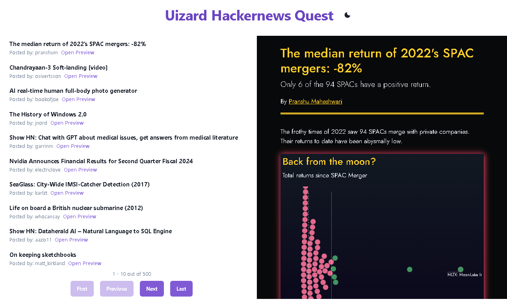

# Uizard Hacker News Reader Quest

This App is a challenge front-end project available through the following link [https://uizard.notion.site/uizard/Quest-Front-end-Developer-89b58e89f4434634a022031b38cdcfaf](https://uizard.notion.site/uizard/Quest-Front-end-Developer-89b58e89f4434634a022031b38cdcfaf).

It consists of a stories/news feed with an incorporated previewer that uses the [Hacker News Api](https://github.com/HackerNews/API) to fetch the latest stories from their public JSON API. It allows the user to have a quick peek of the titles of the stories, clicking them will redirect them to the respective source link of the story. The user has also the possibility to see a preview of the site by clicking the respective "Open Preview" button of each title, showing a panel to the right. Due to security policies not every site is possible to be previewed this way and the user must directly visit the site by clicking on the title.

## Getting Started

To get start with this repository you may run `git clone https://github.com/Horacaz/hacker-news-reader`. After copying the files you will run `npm install` to install the project dependencies. When the dependecies are installed you may run `npm run dev` to start a development server and start previewing and editing the project locally.

## Techstack

This project is built with Typescript on top of React, using the latest build provided by Vite. It is also unit-tested with Jest and React Testing Library.Husky is also implemented to lint every stagged files before every commit to ensure a consistent code style and that each test passes before pushing. For styling, this App uses the components provided by Chakra Ui.

## App Preview

